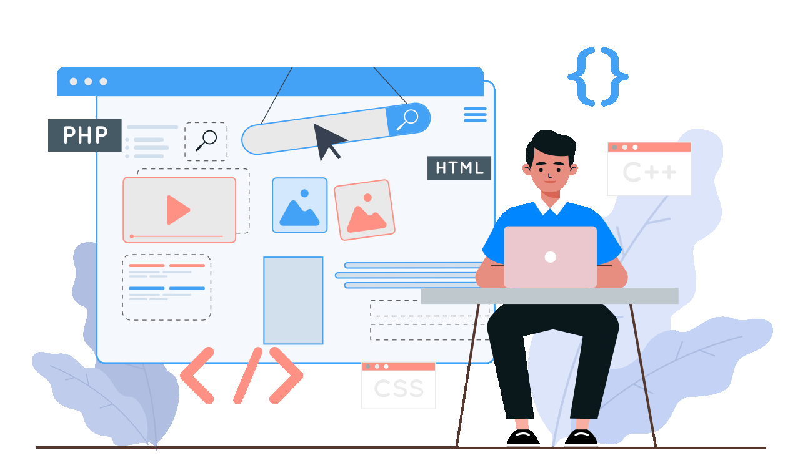

  
  
  

 

  <h1>👋 Hello, I'm Giang Pham</h1>

  
<em>Professional front-end developer from Vietnam 🇻🇳 specializing in React ecosystem and modern web technologies.</em>

  
  

    
    
    
  

## 🎯 About Me

> _"Code is like humor. When you have to explain it, it's bad." - Cory House_

Front-end developer with 3+ years of professional experience in web development. Proficient in React ecosystem (Next.js, React Native) and TypeScript. Strong focus on clean architecture, scalable solutions, and modern development practices. Proven track record of improving workflow efficiency and delivering user-centric solutions.

## 🛠️ Skills & Technologies

### 💻 Programming Languages

  
  
  
  

### 🌐 Frontend Development

  
  
  
  
  
  

### ⚙️ Backend & Databases

  
  
  
  
  
  

### ☁️ Cloud & DevOps

  
  
  
  

### 🛠️ Tools & Others

  
  
  
  
  

### 🎨 Design & Creative

  
  
  

### 🧪 Testing & Documentation

  
  
  
  

## 🚀 Currently Working On

  

  
  
<em>Thanks for visiting! 👋</em>

  
<strong>Let's build something amazing together! 🚀</strong>

